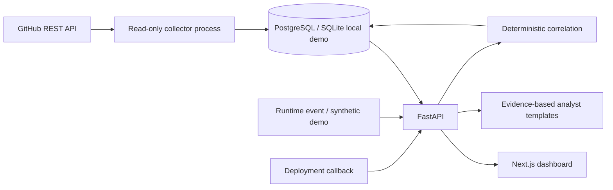

# BuildBrother AI

**From build to behavior. Evidence all the way.**

BuildBrother AI helps a developer and their teammate connect repository changes, workflow runs, deployments, and runtime security evidence. It explains why findings might be related while keeping operational failures separate from security severity.

This is a working **local MVP** of the shared implementation blueprint. It replaces the earlier ThreatLens infrastructure shell. It is not a production SOC, autonomous responder, or proof that a system was compromised.

## What you can do now

- Explore repositories, commits, PRs, pipeline runs and job steps.
- Register services and record deployments tied to a verified workflow/commit.
- Ingest validated runtime events with a dedicated ingestion credential.
- Investigate a combined evidence timeline and an explainable correlation confidence score.
- See missing provenance as explicit gaps, including unlinked zero-confidence incidents.
- Change incident status and leave an audit note without modifying external infrastructure.
- Ask the analyst for a timeline, explanation, summary, or next review steps with evidence citations.
- Run a read-only GitHub App collector with pagination, conditional requests, idempotent upserts, visible permission failures, and rate-limit backoff.
- Use an idempotent safe demo with 12 workflow runs, two services, one deployment, and two initial investigations. The demo includes one linked and one unlinked event, plus ordinary failed tests that do not raise security severity.

The AI Analyst currently uses deterministic evidence templates. It needs no external AI key and never executes source text as instructions. LLM integration and broader question answering are future work.

## Quick start: Docker / PostgreSQL

Install Python 3.12+ for the setup script and start Docker Desktop with Linux containers enabled. From the repository root:

```powershell
python scripts/setup_local.py
docker compose up --build
```

The setup script creates gitignored `.env` files with random local credentials. It preserves existing files. Docker runs versioned migrations and seeds the demo automatically.

- Dashboard: http://localhost:3000
- API reference: http://localhost:8000/docs
- API liveness: http://localhost:8000/api/health
- Database readiness: http://localhost:8000/api/health/ready

`docker compose down` stops services and preserves the database volume. Changing the environment password does not rotate an existing PostgreSQL user's password.

## Quick start: without Docker

Requires Python 3.12, Node.js 22+, and pnpm 11.19.0. SQLite is supported for a local demo; PostgreSQL is the primary Docker/CI database. Both use the same versioned schema.

From the repository root:

```powershell
python scripts/setup_local.py
cd backend
python -m venv .venv
.\.venv\Scripts\python -m pip install -r requirements.lock.txt
.\.venv\Scripts\python -m app.bootstrap
.\.venv\Scripts\python -m uvicorn app.main:app --reload --host 127.0.0.1 --port 8000
```

In another terminal, from `frontend`:

```powershell
corepack enable
pnpm install --frozen-lockfile
pnpm dev --hostname 127.0.0.1
```

On macOS/Linux, use `.venv/bin/python`. For a local production frontend, run `pnpm build` then `pnpm start`.

There are **no user accounts or demo login credentials**. The dashboard is a local trusted interface. Backend read and write credentials are server-only. Do not publish or port-forward this MVP before adding user authentication and authorization.

## Try the demo

1. Open Overview and choose **Investigate** on the linked payments incident.
2. Follow the PR → commit → workflow → deployment → runtime evidence, including the security finding.
3. Compare it with the checkout-worker incident: no deployment is known, so confidence is zero.
4. Open Pipelines and inspect a failed test. It affects operational health only.
5. Use **Simulate event** to ingest a new safe event and create an investigation. It makes no external infrastructure changes.
6. Save an investigation status/note, then ask the AI Analyst what changed or why items were grouped.

Demo repositories are named `demo/...`, with the `synthetic` source and `demo` environment. They are not claims about `RajManohara/BuildBrother-AI`. Set `DEMO_MODE=false` before initializing a fresh database to omit demo seeding. Disabling seeding does not erase existing demo records.

## Connect your actual GitHub repository

Follow [GitHub App setup](docs/GITHUB_SETUP.md). Configure an App installed only on your selected repository, with read-only permissions. Keep its private key in `.env`, never in source control or chat.

```powershell
# From backend, with the environment configured and migrations applied:
.\.venv\Scripts\python -m app.worker --once
# Or continuous collection:
.\.venv\Scripts\python -m app.worker
```

With Docker: `docker compose --profile github up -d collector`.

The collector polls a 30-day window for commits, PR updates, runs and GitHub deployment records. Security alert lists are refreshed separately. It reuses page ETags and upserts source IDs; this is a bounded polling MVP, not a complete archival export. A per-resource page cursor stores cache, last-success and backoff state. Resource errors are visible in Settings. Collection can be partial when features are unavailable.

GitHub deployment records are collected as source evidence but **not automatically mapped to services**. Register a service and submit an authenticated deployment callback to establish that mapping. This avoids guessing that an environment name identifies a service. See [API examples](docs/API_EXAMPLES.md).

## Architecture



The API and collector share one backend codebase. PostgreSQL advisory locking prevents overlapping collector processes. SQLite collection is single-process only. All GitHub resource operations are GET requests; installation-token exchange is the sole authentication POST.

## Repository structure

```text
frontend/
  app/                  App Router, styles, same-origin server proxy
  components/           Overview, evidence tables, investigation, analyst
  lib/                  TypeScript models and shared utilities
  scripts/start.mjs     Local standalone production startup
backend/
  app/api/              Validated API routes
  app/models.py         Evidence, pipeline, deployment and incident models
  app/github.py         GitHub App auth and read-only collection
  app/worker.py         Scheduled collector process
  app/correlation.py    Transparent evidence-linking rules
  app/ingestion.py      Mapping, callback and runtime ingestion
  app/analyst.py        Grounded deterministic explanations
  app/security.py       Credentials, redaction and local rate limiting
  migrations/           Alembic schema history
  tests/                Unit, API, collector and database tests
docs/                   Setup, API examples, security and team roadmap
scripts/setup_local.py  Generate local configuration safely
sample-data/            Safe example event payloads
.github/workflows/      Backend/PostgreSQL and frontend CI
docker-compose.yml
.env.example
```

Stack: Next.js, React, TypeScript, Tailwind, Lucide, a shadcn-compatible button, FastAPI, Pydantic, SQLAlchemy, Alembic, PostgreSQL, PyJWT, httpx, pytest, and Docker. Dashboard charts currently use lightweight CSS bars.

## Confidence and evidence

Security severity comes from the runtime event. Correlation confidence is a separate 0–95 score:

| Contribution | Points |
| --- | ---: |
| Matching service/environment and active successful deployment | 30 |
| Verified workflow matches the deployed commit and repository | 15 |
| Finding applies to exact deployed commit or exact component version/ecosystem | 25 |
| Artifact digest and deployment component manifest are both supplied | 10 |
| Finding's explicitly recorded behavior matches the event | 10 |
| Event occurs within one hour after deployment | 5 |
| Ordinary test/build failure | 0 |

This is an explainable heuristic, **not a calibrated probability**. A supplied digest/manifest is not cryptographic verification of the artifact. Dependabot version ranges are not treated as exact installed versions; findings without exact applicability remain unlinked. Source relationships do not establish causation.

## API

Read requests use `X-API-Key: <APP_API_KEY>` when configured. Write requests also require `Authorization: Bearer <INGEST_TOKEN>`. Swagger displays the schemas; headers can be supplied using curl or the examples.

| Method | Path | Purpose |
| --- | --- | --- |
| GET | `/api/v1/workspace` | Bounded workspace read model (up to 500 records/category) |
| GET | `/api/v1/incidents/{id}` | Timeline, score, gaps and notes |
| POST | `/api/v1/services` | Register a service/repository mapping |
| POST | `/api/v1/deployments/ingest` | Record a deployment and reconcile related events |
| POST | `/api/v1/runtime/events` | Ingest and correlate one event |
| PATCH | `/api/v1/incidents/{id}` | Status update and audit note |
| POST | `/api/v1/analyst` | Retrieve and explain stored incident evidence |

## Configuration

See `.env.example` for every setting. The setup script generates `APP_API_KEY`, `INGEST_TOKEN`, and `POSTGRES_PASSWORD`. `DATABASE_URL` selects the local database; Compose overrides it with its PostgreSQL service URL. `BACKEND_URL` is server-only. `DEMO_MODE` controls seeding. `GITHUB_APP_ID`, `GITHUB_INSTALLATION_ID`, and `GITHUB_PRIVATE_KEY` enable live collection. No OpenAI key is required.

The frontend's `.env.local` must use the same APP_API_KEY and INGEST_TOKEN as the backend. Restart servers after changing environment files.

## Tests

```powershell
# backend
.\.venv\Scripts\python -m pytest -q
.\.venv\Scripts\python -m alembic check
# frontend
pnpm build
pnpm typecheck
# root
docker compose config --quiet
```

For a PostgreSQL integration test, set `TEST_POSTGRES_URL` to a **dedicated disposable test database**. CI provisions one automatically. The tests migrate and seed it; do not point them at production data.

See [verification record](VERIFICATION.md), [security decisions](docs/SECURITY.md), and [two-person roadmap](docs/ROADMAP.md) for limitations and next work.
